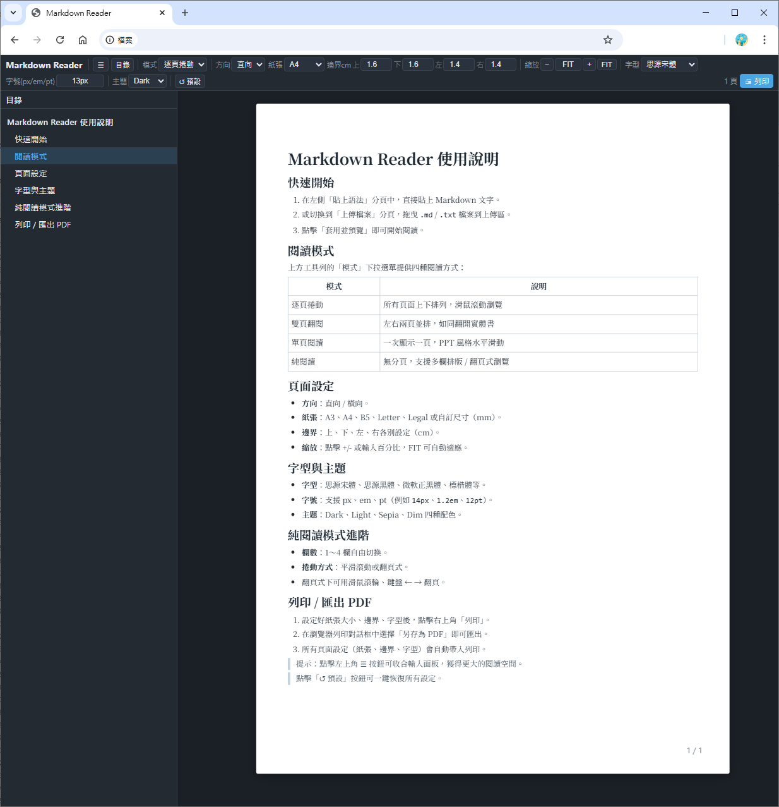

# Markdown Reader

一個純前端、單檔案的 Markdown 電子書閱讀器，無需安裝、無需伺服器，直接在瀏覽器開啟即可使用。

**線上體驗 →** https://sacc19da.github.io/markdown-ebook-reader/

---

## 功能特色

- **四種閱讀模式**：逐頁捲動、雙頁翻閱、單頁閱讀、純閱讀（多欄／翻頁式）
- **頁面設定**：方向（直向／橫向）、紙張大小（A3／A4／B5／Letter／Legal／自訂）、四邊界、縮放
- **字型與主題**：思源宋體、思源黑體、微軟正黑體等；Dark / Light / Sepia / Dim 四種配色
- **列印／匯出 PDF**：所有頁面設定自動帶入，瀏覽器列印對話框選「另存為 PDF」即可
- **純閱讀模式進階**：1–4 欄、平滑滾動或翻頁式（支援滑鼠滾輪與鍵盤 ← → 翻頁）
- **無外部依賴**：所有資源皆已內嵌或本地化，離線可用

## 使用方式

1. 開啟 [線上版](https://sacc19da.github.io/markdown-ebook-reader/) 或直接下載 `markdown-ebook-reader.html` 用瀏覽器開啟
2. 在左側「貼上語法」分頁貼入 Markdown 文字，或切換至「上傳檔案」拖曳 `.md` / `.txt` 檔案
3. 點擊「套用並預覽」開始閱讀

## 授權

MIT License © [sacc19da](mailto:sacc19da@gmail.com)
